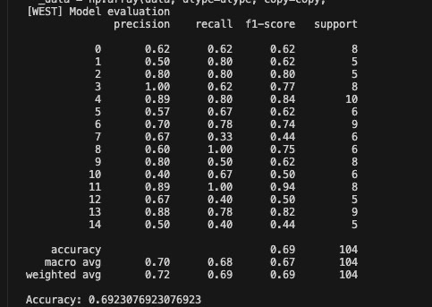
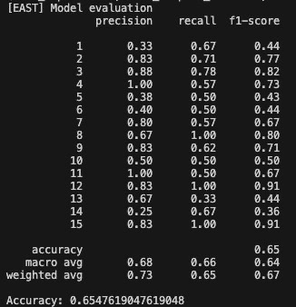
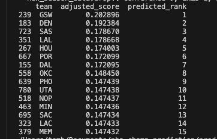
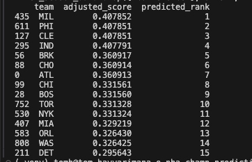

  <h1>NBA Standings Prediction</h1>

## 🎯  Objective & Challenge
The objective is to predict the final standings for the upcoming 2024-2025 NBA regular season. The reason for this project is that,  since it hasn't started yet, there's no game data for the upcoming season, which makes it a difficult endeavour. As a result, we decided to rely on other sources of information such as current roster details, franchise history, and preseason odds.

## 📊 Data Collection
We collected data from [Basketball Reference](https://www.basketball-reference.com/). Our script scraps, formats, aggregates and save the data from different pages dynamically and can be executed for any range of seasons by specifying the start and end years. However, caution is advised when collecting data from older seasons as team names and dataset formats for example may have changed. As of now, the script has successfully gathered data from the 2007 season to the 2025 season. It is recommended to run the script in batches, there's script at the end of the main function to aggregate the collected data into the final dataset.

## 🛠️ Feature Engineering
We engineered several key features from the collected data:

- **Player attributes:** average player characteristics (age, experience, weight, and height) per team.
- **Player salary information:** including each team's highest and median salary.
- **Top player count:** The number of "top players" (defined as players earning more than 20% of the team’s total salary).
- **Franchise performance history:** total championships, championships in the last 4 years, and total playoff appearances.

The target variable is the team **ranking** for each season.

### Final dataset columns:

| **Season**  | **Team Abbreviation** | **Full Team Name** | **Conference** | **Avg Age** | **Avg Exp (years)** | **Avg Weight (lbs)** | **Avg Height (inches)** | **Preseason Odds** | **Highest Salary ($M)** | **Median Salary ($M)**  | **Nb of Top Players** |  **Nb of Non-Top Players** | **Total Championships** |  **Championships (Last 4 Years)** | **Total Playoff Appearances** |  **Ranking [TARGET]** |  
|-------------|-----------------------|--------------------|----------------|-------------|---------------------|----------------------|-------------------------|--------------------|----------------------|-------------------------|-----------------------|---------------------------|--------------------------|-----------------------------|-------------------------|--------------------|

### Note: 
- The **Season** column uses a single year for the season (e.g., for the 2024-2025 season, the value would be 2025).

## ⚙️ Training
Before training, we split the data by conference (Western and Eastern). Each model predicts rankings from 1 to 15 for teams in each conference.

We offer two model choices for training:
- **Random Forest (RF)**: A bagging-based ensemble model.
- **XGBoost**: A boosting-based ensemble model.

For hyperparameter tuning, we used Grid Search to optimize the model. 

After training, the model outputs evaluation metrics such as precision, recall, and F1-score for each rank (1 to 15). The trained model is saved locally as a pickle file.

## 🚀 Results
The best accuracy achieved so far is:
- **Western Conference**: 69% accuracy
- **Eastern Conference**: 65% accuracy

   
  

Once the model is trained and saved, you can use it to predict the standings for the 2024-2025 season. Below are the predicted standings:

   
  

## 🔧 Improvements & Limitations

### Improvements:
- **Enhanced feature engineering**: Additional metrics like "average standings over the past x years" could provide further insight into a team's recent performance.
- **Model refinement**: Given that a significant amount of time was spent on data collection, there is likely room to improve model performance.

### Limitations:
Predicting NBA standings before the season starts is inherently challenging due to unforeseen events (injuries, trades, etc.) during the season, which cannot be accounted for in the model.
